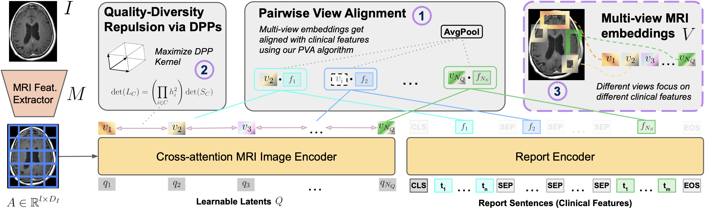

#  : Aligned Multi-View Embeddings for Brain MRI Analysis

<p align="center"></p>

<p align="center">
    <a href="https://arxiv.org/abs/2512.18679"></a>
    <a href="https://opensource.org/licenses/CC-BY-NC-SA-4.0"></a>
    <a href="https://wacv2026.thecvf.com/"></a>
</p>

Official implementation and foundation model weights for , a vision-language pre-training framework leveraging a large-scale dataset of paired brain MRIs and clinical reports (~80,000 sessions). Our models provide a powerful starting point for downstream clinical tasks like report generation, classification, and segmentation.

[**Read the Paper**](https://arxiv.org/abs/2512.18679) | [**BibTeX**](#citation)

---

## Model Zoo

<p align="center"></p>

We provide several foundation models trained on T1 post-contrast (T1c) scans and a high-performing multimodal variant. All weights consist of a vision backbone connected to a QFormer-like architecture to obtain the multi-view embeddings. It is possible to use either the full model (vision backbone + multi-view embeddings) or just the vision backbone for feature extraction.

| Model Name | Input Modalities | Vision Backbone | Weights |
| :--- | :--- | :--- | :--- |
| **-DenseNet121** | T1c | DenseNet-121 | [Download](https://drive.google.com/file/d/1B7Wgz7pxCBcYhp2Cy20Y3NDgQWlZ7Zf5/view?usp=sharing) |
| **-ViT-Base** | T1c | ViT-B/16 | [Download](https://drive.google.com/file/d/1nD4zhKS31biZC7-7dfmXeKOOZQ_6c9WB/view?usp=sharing) |
| **-ResNet50** | T1c | ResNet-50 | [Download](https://drive.google.com/file/d/16pUt5T1fvQQUc6fNHMEOklOd_bp1dDDp/view?usp=sharing) |
| **-Multimodal** | T1c, T1, T2, FLAIR | DenseNet-169 | [Download](https://drive.google.com/file/d/127AK67pytgRCGV9g8R1FLwf0FU5lzblz/view?usp=sharing) |

> **Note (a):** The ViT model provided here is an updated version that outperforms the variant originally reported in the paper, matching the performance of our ResNet foundation model. \
> **Note (b):** The -Multimodal is not reported in the paper and is our strongest model yet.


---

## Usage

Install the required packages using pip:

```bash
pip install -r requirements.txt
```

### Feature Extraction
The `extract_features.py` script contains the necessary code to load the models and generate embeddings for a toy input volume.

**Full Embedding (Vision backbone + multi-view embeddings):**
```bash
python extract_features.py \
  --weights /path/to/weights.bin \
  --vision-model-name densenet121 \
  --in-channels 1 \
  --mode full
```

**Vision backbone only:**
```bash
python extract_features.py \
  --weights /path/to/weights.bin \
  --vision-model-name vit \
  --in-channels 1 \
  --mode vision
```

## Preprocessing Pipeline

For the Multimodal model, modalities must be stacked in the channel dimension ($C=4$) in the following order: T1 post-contrast (T1c); T1; T2; FLAIR. In our dataset, a non-negligible portion of studies are missing one or more of these sequences. In such cases, missing modalities were zero-filled to maintain the 4-channel input structure.

Below is the **MONAI-based preprocessing pipeline** we used for our pre-training runs. Images are expected to be in NIfTI format (`.nii` or `.nii.gz`).

```yaml
- LoadImaged: {}
- EnsureChannelFirstd: {channel_dim: 'no_channel'}
- Spacingd: {pixdim: [1, 1, 1], mode: 'bilinear'}
- Orientationd: {axcodes: 'SAR'}
- Resized: {spatial_size: [32, 256, 256]}
- NormalizeIntensityd: {channel_wise: true, nonzero: true}
- ScaleIntensityd: {channel_wise: true, maxv: 1.0}
```

## Citation

If you make use of our models, please consider citing us at:

```bibtex
@inproceedings{kayser2026brat,
  title     = {brat: Aligned Multi-View Embeddings for Brain MRI Analysis},
  author    = {Kayser, Maxime and Gridnev, Maksim and Wang, Wanting and Bain, Max and Rangnekar, Aneesh and Chatterjee, Avijit and Petrov, Aleksandr and Veeraraghavan, Harini and Swinburne, Nathaniel C.},
  booktitle = {Proceedings of the IEEE/CVF Winter Conference on Applications of Computer Vision (WACV)},
  year      = {2026},
}
```

## License

This project and the accompanying model weights are licensed under the Creative Commons Attribution-Non Commercial-ShareAlike 4.0 International (CC BY-NC-SA 4.0) License.

* Academic/Research Use: Encouraged and permitted.
* Commercial Use: Prohibited. 

For commercial licensing inquiries or if you are unsure if your use case qualifies as non-commercial, please open an issue or contact the maintainers directly.
